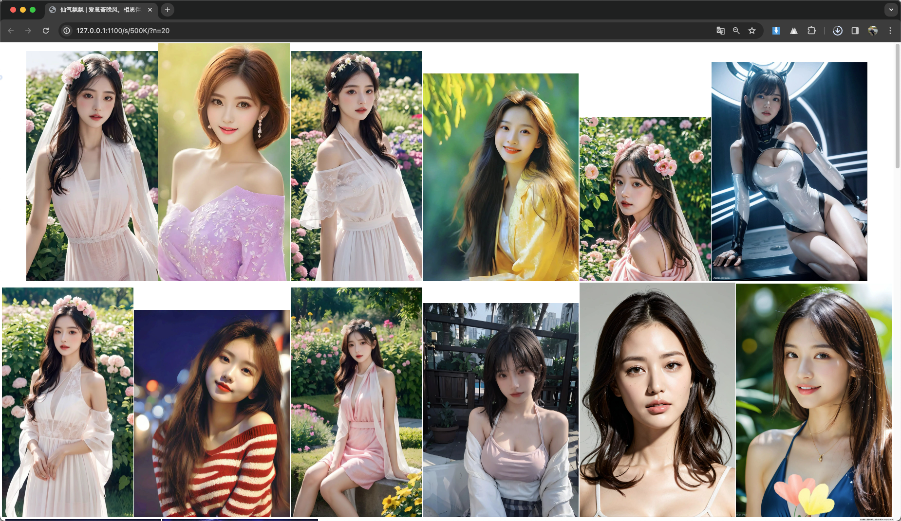

# aimg

ai images viewer

1. 从微信公众号链接中下载图片, 例如: `aimg https://mp.weixin.qq.com/s/sXBUmFpedslBoysUCBVcEw https://mp.weixin.qq.com/s/0-MD2r1yZ_QAxPRNojAn-A`
2. 导入本地图片夹子或者压缩包, 例如: `aimg /Users/bingoo/Downloads/xxx  /Users/bingoo/Downloads/yyy.zip /Users/bingoo/Downloads/zzz.7z`
3. 从 wallhaven.cc 随机下载, 例如： `aimg -page 1 https://wallhaven.cc/randoma`
4. 从 pixabay.com 下载, 例如：`aimg -page 1 https://pixabay.com/users/elf-moondance-19728901/`

查看：

1. 随机查看10张图片： `http://127.0.0.1:1100`
2. 随机查看20张图片： `http://127.0.0.1:1100/?n=20`
3. 查看约100K的图片： `http://127.0.0.1:1100/s/500K/?n=20`




注意：

1. 直接响应图片，只在于 /x/{xxhash}，或者 ?n=1 两种情况


## api

1. http://127.0.0.1:1100/x/f22416f832f92d4e?format=json

```json
{
    "id": "2n3Nslkvlwonbwd62UZhP60YfWu",
    "createdAt": "20241006150008",
    "xxhash": "c429be2178b0ae8a",
    "perceptionHash": "p:a4e4cef6eee68808",
    "perceptionHashGroupId": 93761,
    "contentType": "image/webp",
    "pageLink": "https://mp.weixin.qq.com/s/y4VC3GPain60vGgwx9erBg",
    "title": "中原时尚文化产业研究院::秀场 | Isabel Marant 2025春夏系列",
    "pageId": "2n3KzZL6h3bIA7wY5ALlD7Wss0d",
    "body": "UklGRhh0AQBXRUJQVlA4IAx0AQDQQQidASo4BFQGPm02l0ikIzcuI9T5MuANiWduc85jH4S9jrT4OdPDKrGXyHMSCr9T1a2s3vL0/uJ/uP2r8sP0z/JewL+uHon/5Pgo92/5/sEf2n0M85v+w6T3nJ…126870 more…",
    "size": 95264,
    "format": "webp",
    "width": 1080,
    "height": 1620,
    "humanizeSize": "95kB"
}
```
