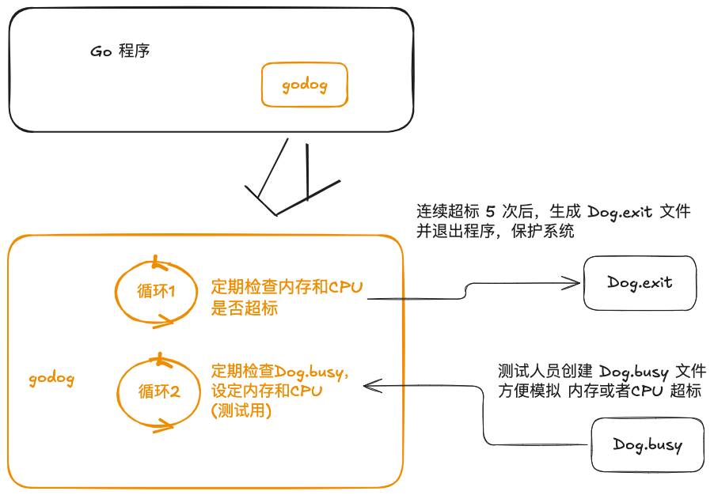

# godog

Watching program itself's memory and cpu, check thresholds, and take actions if threshold condition satified.



[在线版本](https://excalidraw.com/#room=9b150c1ae8f50da5f7c0,DmAt2vj-2EkNypuJ-1nnSg)

## Sample

- build: `make`
- run: `DOG_DEBUG=1 DOG_INTERVAL=3s DOG_RSS=20MiB DOG_CPU=60 dog` 每 3 秒检查一次, 内存上限 30 MiB, CPU 上限 60%
- busy: `echo '{"mem":"20MiB"}' > Dog.busy` 打满 20 MiB 内存
- busy: `echo '{"cores":3,"cpu":100}' > Dog.busy` 打满 3 个核
- busy: `echo '{"pprof": "15s"}' > Dog.busy` 在15秒后生成 cpu/mem.pprof 文件
- watch: `watch 'ps aux | awk '\''NR==1 || /godog/ && !/awk/'\'''`
- pprofile: `go tool pprof -http=:8080 Dog.xxx.prof`

## Usage

一行代码集成

`import _ "github.com/bingoohuang/ngg/dog/autoload"`

## Environment

| Name              | Default    | Meaning                      | Usage                         |
|-------------------|------------|------------------------------|-------------------------------|
| DOG_DEBUG         | 0          | Debug mode                   | `export DOG_DEBUG=1`          |
| DOG_RSS           | 256 MiB    | 内存上限                         | `export DOG_RSS=30MiB`        |
| DOG_CPU           | 50 * cores | CPU百分比上限                     | `export DOG_CPU=200`          |
| DOG_INTERVAL      | 1m         | 检查时间间隔                       | `export DOG_INTERVAL=5m`      |
| DOG_JITTER        | 10s        | 间隔补充随机时间                     | `export DOG_JITTER=1m`        |
| DOG_TIMES         | 5          | 触发上限次数                       | `export DOG_TIMES=10`         |
| DOG_DIR           | 当前目录       | 检查 Dog.busy 和生成 Dog.exit 的路径 | `export DOG_DIR=/etc/dog`     |
| DOG_BUSY_INTERVAL | 10s        | 检查 Dog.busy 文件的间隔时间          | `export DOG_BUSY_INTERVAL=1m` |

注:

- 达到次数，默认动作会导致进程退出，保护整个系统
- 退出时，会生成文件 Dog.exit

## Dog.busy 文件结构示例

本文件，用于给当前进程设定指定的内存或者CPU，用于模拟测试。

```json
{
  "mem": "20MiB",
  "cores": 3,
  "cpu": 100,
  "lockOsThread": false
}
```

1. mem: 目标内存
2. cores: cpu 使用核数
3. cpu: cpu 每核百分比, 0-100
4. lockOsThread: 是否在 CPU 耗用时锁定 OS 线程

## Dog.exit 文件内容示例

```json
{
  "pid": 82963,
  "time": "2024-08-08T23:07:10+08:00",
  "reasons": [
    {
      "type": "RSS",
      "reason": "连续 5 次超标",
      "values": [21790720, 21803008, 21807104, 21811200, 21811200],
      "threshold": 20971520,
      "profile": "Dog.mem.82963.prof"
    }
  ]
}
```

```json
{
  "pid": 84154,
  "time": "2024-08-08T23:13:13+08:00",
  "reasons": [
    {
      "type": "CPU",
      "reason": "连续 5 次超标",
      "values": [62, 65, 66, 69, 69],
      "threshold": 60,
      "profile": "Dog.cpu.84154.prof"
    }
  ]
}
```

## log

```sh
$ DOG_DEBUG=1 DOG_INTERVAL=3s DOG_RSS=20MiB DOG_CPU=60 godog
2024/08/08 23:06:39 current RSS: 2.8 MiB, CPU: 0.135749
2024/08/08 23:06:42 current RSS: 2.9 MiB, CPU: 0.095724
2024/08/08 23:06:44 read file Dog.busy: "{\"mem\":\"20MiB\"}\n"
2024/08/08 23:06:46 current RSS: 21 MiB, CPU: 0.941265
2024/08/08 23:06:46 current RSS thresholdState: [21790720]
2024/08/08 23:06:53 current RSS: 21 MiB, CPU: 0.592242
2024/08/08 23:06:53 current RSS thresholdState: [21790720 21803008]
2024/08/08 23:06:55 current RSS: 21 MiB, CPU: 0.546832
2024/08/08 23:06:55 current RSS thresholdState: [21790720 21803008 21807104]
2024/08/08 23:07:00 current RSS: 21 MiB, CPU: 0.452665
2024/08/08 23:07:00 current RSS thresholdState: [21790720 21803008 21807104 21811200]
2024/08/08 23:07:10 current RSS: 21 MiB, CPU: 0.329811
2024/08/08 23:07:10 current RSS thresholdState: [21790720 21803008 21807104 21811200 21811200]
2024/08/08 23:07:10 godo reach times: [{RSS 连续 5 次超标 [21790720 21803008 21807104 21811200 21811200] 20971520 Dog.mem.82963.prof}]
2024/08/08 23:07:10 program exit by godog, reason: [{RSS 连续 5 次超标 [21790720 21803008 21807104 21811200 21811200] 20971520 Dog.mem.82963.prof}]
```

```sh
$ DOG_DEBUG=1 DOG_INTERVAL=3s DOG_RSS=20MiB DOG_CPU=60 godog
2024/08/08 23:11:35 current RSS: 2.7 MiB, CPU: 0.092319
2024/08/08 23:11:36 current RSS: 2.8 MiB, CPU: 0.083957
2024/08/08 23:11:41 current RSS: 2.9 MiB, CPU: 0.060528
2024/08/08 23:11:47 current RSS: 2.9 MiB, CPU: 0.045655
2024/08/08 23:11:49 current RSS: 2.9 MiB, CPU: 0.043448
2024/08/08 23:11:50 current RSS: 3.0 MiB, CPU: 0.045685
2024/08/08 23:11:54 current RSS: 3.0 MiB, CPU: 0.040624
2024/08/08 23:11:57 read file Dog.busy: "{\"cores\":3,\"cpu\":100}\n"
2024/08/08 23:11:57 current RSS: 3.2 MiB, CPU: 0.372026
2024/08/08 23:12:00 current RSS: 3.2 MiB, CPU: 9.853160
2024/08/08 23:12:04 current RSS: 3.2 MiB, CPU: 17.868310
2024/08/08 23:12:08 current RSS: 3.2 MiB, CPU: 26.903805
2024/08/08 23:12:17 current RSS: 3.2 MiB, CPU: 39.012128
2024/08/08 23:12:25 current RSS: 3.2 MiB, CPU: 46.668069
2024/08/08 23:12:31 current RSS: 3.2 MiB, CPU: 52.205830
2024/08/08 23:12:34 current RSS: 3.2 MiB, CPU: 53.463527
2024/08/08 23:12:38 current RSS: 3.2 MiB, CPU: 56.138006
2024/08/08 23:12:38 current RSS: 3.2 MiB, CPU: 56.143797
2024/08/08 23:12:45 current RSS: 3.2 MiB, CPU: 59.623325
2024/08/08 23:12:50 current RSS: 3.3 MiB, CPU: 62.309623
2024/08/08 23:12:50 current CPU thresholdState: [62]
2024/08/08 23:12:59 current RSS: 3.5 MiB, CPU: 65.742030
2024/08/08 23:12:59 current CPU thresholdState: [62 65]
2024/08/08 23:13:02 current RSS: 3.5 MiB, CPU: 66.639235
2024/08/08 23:13:02 current CPU thresholdState: [62 65 66]
2024/08/08 23:13:11 current RSS: 3.6 MiB, CPU: 69.468573
2024/08/08 23:13:11 current CPU thresholdState: [62 65 66 69]
2024/08/08 23:13:13 current RSS: 3.6 MiB, CPU: 69.991274
2024/08/08 23:13:13 current CPU thresholdState: [62 65 66 69 69]
2024/08/08 23:13:13 godo reach times: [{CPU 连续 5 次超标 [62 65 66 69 69] 60 Dog.cpu.84154.prof}]
2024/08/08 23:13:13 program exit by godog, reason: [{CPU 连续 5 次超标 [62 65 66 69 69] 60 Dog.cpu.84154.prof}]
```


## cgo memory

1. test cgo memory malloc:
  - `TAGS=cgomem make`
  - `DOG_DEBUG=1 DOG_INTERVAL=3s DOG_RSS=20MiB DOG_CPU=20 godog -cgo-mem 20MiB`
