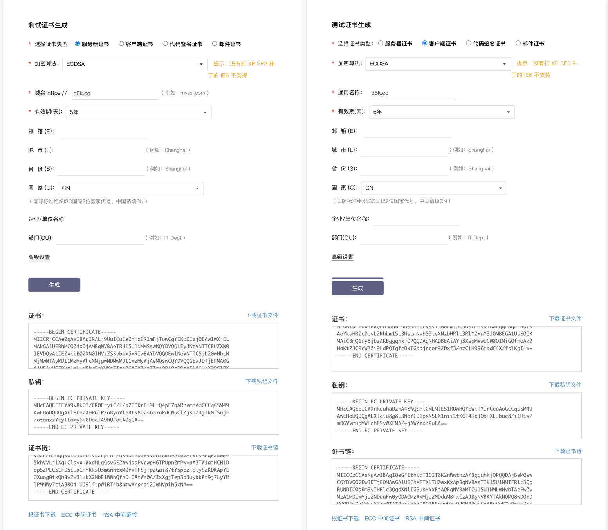

# mTLS Golang Example

用法:

1. 生成证书 `mtls mkcerts`

```sh
$ DNS_NAMES=demo.top mtls mkcerts
2024/03/14 09:23:55 Created ✅. CertFile: certs/ca.crt, KeyFile: certs/ca.key
2024/03/14 09:24:00 Created and Signed server ✅. CertFile: certs/server.crt, KeyFile: certs/server.key
2024/03/14 09:24:03 Created and Signed client ✅. CertFile: certs/client.crt, KeyFile: certs/client.key
```

- [mTLS Golang Example](#mtls-golang-example)
    - [1. What is mutual TLS (mTLS)?](#1-what-is-mutual-tls-mtls)
    - [2. How does mTLS work?](#2-how-does-mtls-work)
    - [3. Example Walkthrough](#3-example-walkthrough)
        - [3.1 Certs and Keys](#31-certs-and-keys)
            - [3.1.2 Using Golang generate the Certs and Keys](#312-using-golang-generate-the-certs-and-keys)
            - [3.1.2 Using OpenSSL generate the Certs and Keys](#312-using-openssl-generate-the-certs-and-keys)
        - [3.2 Server.go](#32-servergo)
        - [3.3 Client.go](#33-clientgo)

## 1. What is mutual TLS (mTLS)?

Mutual TLS, or mTLS for short, is a method
for [mutual authentication](https://en.wikipedia.org/wiki/Mutual_authentication). mTLS using TLS do both side
authentication & authorization.

mTLS helps ensure that traffic is secure and trusted in both directions between a client and server.

## 2. How does mTLS work?

Normally in TLS, the server has a TLS certificate and a public/private key pair, while the client does not. The typical
TLS process works like this:

1. Client connects to server
2. Server presents its TLS certificate
3. Client verifies the server's certificate
4. Client and server exchange information over encrypted TLS connection

In mTLS, however, both the client and server have a certificate, and both sides authenticate using their public/private
key pair. Compared to regular TLS, there are additional steps in mTLS to verify both parties (additional steps in **bold
**):

1. Client connects to server
2. Server presents its TLS certificate
3. Client verifies the server's certificate
4. **Client presents its TLS certificate**
5. **Server verifies the client's certificate**
6. **Server grants access**
7. Client and server exchange information over encrypted TLS connection

[![](https://mermaid.ink/img/eyJjb2RlIjoiJSV7aW5pdCA6IFxuXG59JSVcblxuc2VxdWVuY2VEaWFncmFtXG4gICAgQ2xpZW50IC0-PiBTZXJ2ZXI6ICgxKSBDb25uZWN0IFJlcXVlc3RcbiAgICBTZXJ2ZXIgLT4-IENsaWVudCA6ICgyKSBQcmVzZW50IHNlcnZlcidzIFRMUyBjZXJ0aWZpY2F0ZVxuICAgIE5vdGUgbGVmdCBvZiBDbGllbnQgOiAoMykgQ2xpZW50IHZlcmlmaWVzIFNlcnZlcidzIGNlcnRmaWNhdGVcbiAgICBDbGllbnQgLT4-IFNlcnZlciA6ICg0KSBQcmVzZW50IGNsaWVudCdzIFRMUyBjZXJ0ZmljYXRlXG4gICAgIE5vdGUgcmlnaHQgb2YgU2VydmVyIDogKDUpIFNlcnZlciB2ZXJpZmllcyBDbGllbnQncyBjZXJ0ZmljYXRlXG4gICAgU2VydmVyIC0-PiBDbGllbnQ6ICg2KSBTZXJ2ZXIgZ3JhbnRzIGFjY2Vzc1xuICAgICBcbiAgICBDbGllbnQgLS0pIFNlcnZlcjogKDcpIGV4Y2hhbmdlIHRoZSBpbmZyb21hdGlvblxuICAgIFNlcnZlciAtLSkgQ2xpZW50IDogXG5cblxuICAgIFxuICAgICAgICAgICAgIiwibWVybWFpZCI6eyJ0aGVtZSI6ImJhc2UiLCJ0aGVtZVZhcmlhYmxlcyI6eyJiYWNrZ3JvdW5kIjoiIzAwMCIsImZvbnRGYW1pbHkiOiJhcmlhbCIsImZvbnRTaXplIjoiMThweCIsInByaW1hcnlDb2xvciI6InJnYigyNDYgMjQ4IDI1MCkiLCJub3RlQmtnQ29sb3IiOiIjZmZmIiwibm90ZVRleHRDb2xvciI6IiMwMDAiLCJub3RlQm9yZGVyQ29sb3IiOiIjZmZmIn19LCJ1cGRhdGVFZGl0b3IiOmZhbHNlLCJhdXRvU3luYyI6dHJ1ZSwidXBkYXRlRGlhZ3JhbSI6ZmFsc2V9)](https://mermaid.live/edit#eyJjb2RlIjoiJSV7aW5pdCA6IFxuXG59JSVcblxuc2VxdWVuY2VEaWFncmFtXG4gICAgQ2xpZW50IC0-PiBTZXJ2ZXI6ICgxKSBDb25uZWN0IFJlcXVlc3RcbiAgICBTZXJ2ZXIgLT4-IENsaWVudCA6ICgyKSBQcmVzZW50IHNlcnZlcidzIFRMUyBjZXJ0aWZpY2F0ZVxuICAgIE5vdGUgbGVmdCBvZiBDbGllbnQgOiAoMykgQ2xpZW50IHZlcmlmaWVzIFNlcnZlcidzIGNlcnRmaWNhdGVcbiAgICBDbGllbnQgLT4-IFNlcnZlciA6ICg0KSBQcmVzZW50IGNsaWVudCdzIFRMUyBjZXJ0ZmljYXRlXG4gICAgIE5vdGUgcmlnaHQgb2YgU2VydmVyIDogKDUpIFNlcnZlciB2ZXJpZmllcyBDbGllbnQncyBjZXJ0ZmljYXRlXG4gICAgU2VydmVyIC0-PiBDbGllbnQ6ICg2KSBTZXJ2ZXIgZ3JhbnRzIGFjY2Vzc1xuICAgICBcbiAgICBDbGllbnQgLS0pIFNlcnZlcjogKDcpIGV4Y2hhbmdlIHRoZSBpbmZyb21hdGlvblxuICAgIFNlcnZlciAtLSkgQ2xpZW50IDogXG5cblxuICAgIFxuICAgICAgICAgICAgIiwibWVybWFpZCI6IiAgICB7XG4gICAgICAgIFwidGhlbWVcIjogXCJiYXNlXCIsXG4gICAgICAgIFwidGhlbWVWYXJpYWJsZXNcIiA6IHtcbiAgICAgICAgICAgIFwiYmFja2dyb3VuZFwiIDpcIiMwMDBcIixcbiAgICAgICAgICAgIFwiZm9udEZhbWlseVwiOiBcImFyaWFsXCIsXG4gICAgICAgICAgICBcImZvbnRTaXplXCIgOiBcIjE4cHhcIixcbiAgICAgICAgICAgIFwicHJpbWFyeUNvbG9yXCI6IFwicmdiKDI0NiAyNDggMjUwKVwiLFxuICAgICAgICAgICAgXCJub3RlQmtnQ29sb3JcIjogXCIjZmZmXCIsXG4gICAgICAgICAgICBcIm5vdGVUZXh0Q29sb3JcIjpcIiMwMDBcIixcbiAgICAgICAgICAgIFwibm90ZUJvcmRlckNvbG9yXCI6IFwiI2ZmZlwiXG4gICAgICAgIH1cbiAgICB9IiwidXBkYXRlRWRpdG9yIjpmYWxzZSwiYXV0b1N5bmMiOnRydWUsInVwZGF0ZURpYWdyYW0iOmZhbHNlfQ)

## 3. Example Walkthrough

### build && environments

`go build -o demo ./cmd/mtls/*.go`

| environments         | default value         | scope          | usage                            |
|----------------------|-----------------------|----------------|----------------------------------|
| INSECURE_SKIP_VERIFY | false                 | server, client | tls.Config.InsecureSkipVerify    |
| CLIENT_CA_OFF        | false                 | client         | No client certs                  |
| CLIENT_AUTH_OFF      | false                 | server         | Do not authenticate client certs |
| DNS_NAMES            | "localhost", "d5k.co" | server cert    | DNS domain name for certificates |

### 3.1 Certs and Keys

#### 3.1.2 Using Golang generate the Certs and Keys

The source code is [certs.go](certs.go), just simply run: `./demo mkcerts`

This source code only uses the Go Standard Library - the x509 package

There are two functions - `makeCA()` and `makeCert()`

- In `makeCA()`, we need to set the `IsCA` flag to `true`
- In `makeCert()`, we set the `DNSNames` as `localhost`

#### 3.1.2 Using OpenSSL generate the Certs and Keys

The completed script is [key.sh](key.sh)

1. **Generate CA Root**. The first thing we need to do to add mTLS to the connection is to generate a self-signed rootCA
   file that would be used to sign both the server and client cert.

    ```bash
    openssl req -newkey rsa:2048 -new -nodes -x509 -days ${DAYS} -out ca.crt -keyout ca.key -subj "/C=SO/ST=Earth/L=Mountain/O=MegaEase/OU=MegaCloud/CN=localhost"
    ```

2. **Generate the Server Certificate**

    ```bash
    #create a key for server
    openssl genrsa -out server.key 2048

    #generate the Certificate Signing Request
    openssl req -new -key server.key -days ${DAYS} -out server.csr -subj "/C=SO/ST=Earth/L=Mountain/O=MegaEase/OU=MegaCloud/CN=localhost"

    #sign it with Root CA
    openssl x509  -req -in server.csr -extfile <(printf "subjectAltName=DNS:localhost") -CA ca.crt -CAkey ca.key  -days ${DAYS} -sha256 -CAcreateserial -out server.crt
    ```

   > Note:  after golang 1.15, we could have the following errors:
   >
   > x509: certificate relies on legacy Common Name field, use SANs or temporarily enable Common Name matching with
   GODEBUG=x509ignoreCN=0"
   >
   > https://stackoverflow.com/questions/64814173/how-do-i-use-sans-with-openssl-instead-of-common-name

3. **Generate the Client certification**

   It's similar to server-side

    ```bash
    openssl genrsa -out ${CLIENT}.key 2048

    openssl req -new -key ${CLIENT}.key -days ${DAYS} -out ${CLIENT}.csr -subj "/C=SO/ST=Earth/L=Mountain/O=$O/OU=$OU/CN=localhost"

    openssl x509 -req -in ${CLIENT}.csr -extfile <(printf "subjectAltName=DNS:localhost") -CA ca.crt -CAkey ca.key -out ${CLIENT}.crt -days ${DAYS} -sha256 -CAcreateserial
    ```

#### 3.1.2 Using [测试证书生成](https://myssl.com/create_test_cert.html) generate the Certs and Keys



Refer: [gRPC在Go中的使用（三）gRPC实现TLS加密通信与流模式](https://razeen.me/posts/how-to-use-grpc-in-golang-03/)

### 3.2 Server

The [server.go](server.go) has the following works.

- Listen on both HTTP(`8080`) and HTTPS(`8443`). For mTLS, we only consider the HTTPS.
- It needs the three files
    - CA Root certificate `ca.crt`
    - Server's certificate `servier.crt` and its private key `server.key`
- `/hello` is the HTTP API call, which would reply "Hello, World" to the client.

To enable the mTLS , it requires for a CA pool and client-side authentication, something like below

```go
caCertPool := x509.NewCertPool()
caCertFile, err := ioutil.ReadFile("./certs/ca.crt")
caCertPool.AppendCertsFromPEM(caCertFile)
...
...
tlsConfig := &tls.Config{
ClientCAs:  caCertPool,
ClientAuth: tls.RequireAndVerifyClientCert, //<-- this is the key
MinVersion: tls.VersionTLS12,
}
```

You can run Server like this

```bash
$ mtls server
```

When the client successfully sent the request. It would output the header and TLS connection state which includes the
client's subjects.

```log
(HTTP) Listen on :8080
(HTTPS) Listen on :8443
2021/12/31 14:47:13 >>>>>>>>>>>>>>>> Header <<<<<<<<<<<<<<<<
2021/12/31 14:47:13 User-Agent:curl/7.77.0
2021/12/31 14:47:13 Accept:*/*
2021/12/31 14:47:13 >>>>>>>>>>>>>>>> State <<<<<<<<<<<<<<<<
2021/12/31 14:47:13 Version: 303
2021/12/31 14:47:13 HandshakeComplete: true
2021/12/31 14:47:13 DidResume: false
2021/12/31 14:47:13 CipherSuite: c02f
2021/12/31 14:47:13 NegotiatedProtocol: h2
2021/12/31 14:47:13 NegotiatedProtocolIsMutual: true
2021/12/31 14:47:13 Certificate chain:
2021/12/31 14:47:13  0 s:/C=[SO]/ST=[Earth]/L=[Mountain]/O=[Client-B]/OU=[Client-B-OU]/CN=localhost
2021/12/31 14:47:13    i:/C=[SO]/ST=[Earth]/L=[Mountain]/O=[MegaEase]/OU=[MegaCloud]/CN=localhost
2021/12/31 14:47:13  1 s:/C=[SO]/ST=[Earth]/L=[Mountain]/O=[MegaEase]/OU=[MegaCloud]/CN=localhost
2021/12/31 14:47:13    i:/C=[SO]/ST=[Earth]/L=[Mountain]/O=[MegaEase]/OU=[MegaCloud]/CN=localhost
2021/12/31 14:47:13 >>>>>>>>>>>>>>>>> End <<<<<<<<<<<<<<<<<<
```

### 3.3 Client.go

The [client.go](client.go) has the following works.

It needs the three files -  `ca.crt`, `client1.crt`, `client1.key`

```bash
$ mtls client --url "https://localhost:8443" -c client1
$ mtls client --url "https://localhost:8443" -c client2
```

You also can use the `curl` to connect to the server.

```bash
curl --trace trace.log -k --cacert certs/ca.crt --cert certs/client.b.crt --key ./certs/client.b.key https://localhost:8443/hello
```

- `--trace trace.log` would record the network details of how the client communicates to the server.
- `-k` because we use a self-signed certificate, so we need to add this.

## OpenSSL 生成证书示例

    x509: certificate relies on legacy Common Name field, use SANs or temporarily enable Common Name matching with GODEBUG=x509ignoreCN=0

如果出现上述报错，是因为 go 1.15 版本开始[废弃 CommonName](https://golang.org/doc/go1.15#commonname)，因此推荐使用 SAN 证书。
如果想兼容之前的方式，需要设置环境变量 `GODEBUG` 为 x509ignoreCN=0。

下面简单示例如何用 openssl 生成 ca 和双方 SAN 证书。

准备默认 OpenSSL 配置文件于当前目录。此配置文件在 linux 系统下通常位于 `/etc/pki/tls/openssl.cnf`，在 mac
系统下通常位于 `/System/Library/OpenSSL/openssl.cnf`。

如果存在，则直接拷贝到当前目录，例如 `cp /etc/pki/tls/openssl.cnf ./my-openssl.cnf`。如果不存在可以使用下面的命令来创建。

```sh
cat > my-openssl.cnf << EOF
[ ca ]
default_ca = CA_default
[ CA_default ]
x509_extensions = usr_cert
[ req ]
default_bits        = 2048
default_md          = sha256
default_keyfile     = privkey.pem
distinguished_name  = req_distinguished_name
attributes          = req_attributes
x509_extensions     = v3_ca
string_mask         = utf8only
[ req_distinguished_name ]
[ req_attributes ]
[ usr_cert ]
basicConstraints       = CA:FALSE
nsComment              = "OpenSSL Generated Certificate"
subjectKeyIdentifier   = hash
authorityKeyIdentifier = keyid,issuer
[ v3_ca ]
subjectKeyIdentifier   = hash
authorityKeyIdentifier = keyid:always,issuer
basicConstraints       = CA:true
EOF
```

生成默认 ca:

    openssl genrsa -out ca.key 2048
    openssl req -x509 -new -nodes -key ca.key -subj "/CN=example.ca.com" -days 5000 -out ca.crt

生成 frps 证书:

    openssl genrsa -out server.key 2048

    openssl req -new -sha256 -key server.key \
    -subj "/C=XX/ST=DEFAULT/L=DEFAULT/O=DEFAULT/CN=server.com" \
    -reqexts SAN \
    -config <(cat my-openssl.cnf <(printf "\n[SAN]\nsubjectAltName=DNS:localhost,IP:127.0.0.1,DNS:example.server.com")) \
    -out server.csr

    openssl x509 -req -days 365 -sha256 \
    -in server.csr -CA ca.crt -CAkey ca.key -CAcreateserial \
    -extfile <(printf "subjectAltName=DNS:localhost,IP:127.0.0.1,DNS:example.server.com") \
    -out server.crt

生成 frpc 的证书:

    openssl genrsa -out client.key 2048
    openssl req -new -sha256 -key client.key \
    -subj "/C=XX/ST=DEFAULT/L=DEFAULT/O=DEFAULT/CN=client.com" \
    -reqexts SAN \
    -config <(cat my-openssl.cnf <(printf "\n[SAN]\nsubjectAltName=DNS:client.com,DNS:example.client.com")) \
    -out client.csr

    openssl x509 -req -days 365 -sha256 \
    -in client.csr -CA ca.crt -CAkey ca.key -CAcreateserial \
    -extfile <(printf "subjectAltName=DNS:client.com,DNS:example.client.com") \
    -out client.crt

在本例中，server.crt 和 client.crt 都是由默认 ca 签发的，因此他们对默认 ca 是合法的。

## thanks

1. [Implementing mTLS in Go](https://ayada.dev/posts/implementing-mtls-in-go/)
2. [haoel/mTLS](https://github.com/haoel/mTLS)
3. [frp 自定义 TLS 协议加密](https://gofrp.org/docs/features/common/network/network-tls/)
4. [Exploring TLS certificates and their limits](./tlscertlimits)
