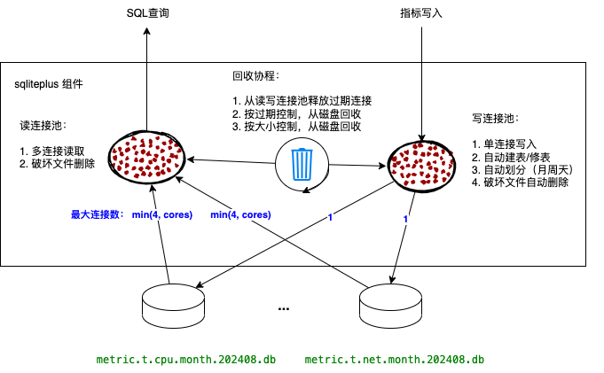

# sqliter

1. 一表一库：sqlite 依然按照一表一库文件（保证写性能）
2. 按月拆分：数据库文件按照自然月来拆分，例如 (metric.t.cpu.202408.db， metric.t.cpu.202407.db）
3. 读写分离：查询可以并发，写入控制单线程（读写使用不用的数据库句柄）
4. 回收策略：不再使用 vacuum 回收空间（会产生磁盘IO突刺），直接删除过期的库文件
5. 按月查询：UI 查询时间范围限制在一个自然月范围内
6. 宽松保留：保留打点数据天数和保留打点文件最大大小，不从当前月库文件中删除数据
7. 破坏删除: 对于由于断电等原因造成的库文件破坏，直接删除重建




```sh
~/rigaga> ls rigaga.db* | sort-by -r modified                08/13/2024 06:00:06 PM
╭────┬─────────────────────────────────────────┬──────┬───────────┬────────────────╮
│  # │                  name                   │ type │   size    │    modified    │
├────┼─────────────────────────────────────────┼──────┼───────────┼────────────────┤
│  0 │ rigaga.db.processes.month.202408.db-wal │ file │   3.9 MiB │ now            │
│  1 │ rigaga.db.system.month.202408.db-wal    │ file │   3.9 MiB │ now            │
│  2 │ rigaga.db.net.month.202408.db-wal       │ file │   4.0 MiB │ now            │
│  3 │ rigaga.db.disk.month.202408.db-wal      │ file │   4.0 MiB │ now            │
│  4 │ rigaga.db.diskio.month.202408.db-wal    │ file │   4.0 MiB │ now            │
│  5 │ rigaga.db.mem.month.202408.db-wal       │ file │   4.0 MiB │ now            │
│  6 │ rigaga.db.cpu.month.202408.db-wal       │ file │   4.0 MiB │ 24 seconds ago │
│  7 │ rigaga.db.mem.month.202408.db           │ file │ 648.0 KiB │ 2 minutes ago  │
│  8 │ rigaga.db.processes.month.202408.db     │ file │ 460.0 KiB │ 3 minutes ago  │
│  9 │ rigaga.db.net.month.202408.db           │ file │   6.3 MiB │ 4 minutes ago  │
│ 10 │ rigaga.db.diskio.month.202408.db        │ file │   1.1 MiB │ 4 minutes ago  │
│ 11 │ rigaga.db.disk.month.202408.db          │ file │   4.4 MiB │ 6 minutes ago  │
│ 12 │ rigaga.db.cpu.month.202408.db           │ file │ 768.0 KiB │ 22 minutes ago │
│ 13 │ rigaga.db.system.month.202408.db        │ file │ 532.0 KiB │ 34 minutes ago │
│ 14 │ rigaga.db.cpu.month.202408.db-shm       │ file │  32.0 KiB │ 14 hours ago   │
│ 15 │ rigaga.db.processes.month.202408.db-shm │ file │  32.0 KiB │ 14 hours ago   │
│ 16 │ rigaga.db.mem.month.202408.db-shm       │ file │  32.0 KiB │ 14 hours ago   │
│ 17 │ rigaga.db.diskio.month.202408.db-shm    │ file │  32.0 KiB │ 14 hours ago   │
│ 18 │ rigaga.db.net.month.202408.db-shm       │ file │  32.0 KiB │ 14 hours ago   │
│ 19 │ rigaga.db.disk.month.202408.db-shm      │ file │  32.0 KiB │ 14 hours ago   │
│ 20 │ rigaga.db.system.month.202408.db-shm    │ file │  32.0 KiB │ 14 hours ago   │
╰────┴─────────────────────────────────────────┴──────┴───────────┴────────────────╯
```


注: 上述 ls 使用 [nushell](https://github.com/nushell/nushell) 执行。

## test

```sh
$ go clean -testcache
$ go test ./...      
?       github.com/bingoohuang/ngg/sqliter/cmd/sqliteplus        [no test files]
?       github.com/bingoohuang/ngg/sqliter/sqlrun        [no test files]
ok      github.com/bingoohuang/ngg/sqliter       2.438s
$ 
```

## 资料

———— [避免过大的WAL文件](https://runebook.dev/zh/docs/sqlite/wal)

在正常情况下，新内容会追加到 WAL 文件中，直到 WAL 文件累积到大约 1000 页（因此大小约为 4MB），此时会自动运行检查点并回收 WAL 文件。检查点通常不会截断 WAL 文件（除非设置了 journal_size_limit pragma ）。
相反，它只会导致 SQLite 从头开始​​覆盖 WAL 文件。这样做是因为覆盖现有文件通常比追加速度更快。当与数据库的最后一个连接关闭时，该连接会执行最后一个检查点，然后删除 WAL 及其关联的共享内存文件，以清理磁盘。

因此在绝大多数情况下，应用程序根本不需要担心 WAL 文件。 SQLite 会自动处理它。但有可能让 SQLite 进入WAL文件无限制增长的状态，导致磁盘空间使用过多和查询速度缓慢。以下要点列举了发生这种情况的一些方式以及如何避免它们。